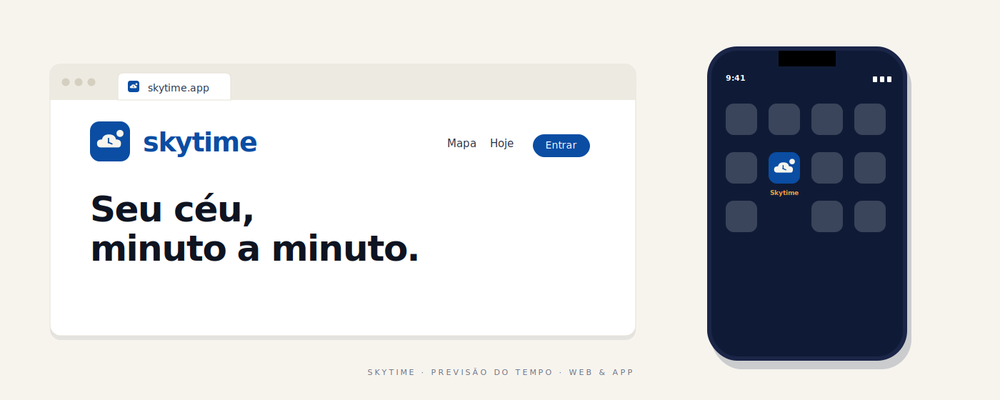

<p align="center">
  
</p>

<p align="center">
  Dashboard de clima editorial para qualquer cidade do mundo.<br/>
  Clima atual, previsão horária e diária, mapa interativo, hora local e<br/>
  recomendações do dia em uma única tela contínua.
</p>

---

## O que é

Skytime é um dashboard de clima focado em ler bem em qualquer tela, do desktop ao celular. A informação é dividida em três zonas verticais conectadas por um gradiente do azul céu ao navy editorial: a primeira é contemplativa (foto do céu reativa, dados principais, hora local), a segunda é prática (o que vestir, próximo evento, hora dourada), a terceira é densa (mapa, chance de chuva, previsão dos próximos dias).

Os dados vêm da Open Meteo. A camada editorial em cima é própria: chips de recomendação, frase de mood do dia, contagem regressiva pro próximo evento climatológico, hora dourada e hora azul calculadas a partir do nascer e pôr do sol.

## Recursos

### Visualização

- Temperatura atual com sensação térmica, umidade, vento e condição
- Previsão horária para as próximas 24 horas em strip horizontal
- Previsão diária para os próximos 5 dias
- Hora dourada e hora azul, manhã e tarde, calculadas a partir do sol
- Mapa interativo com tile escuro do CartoDB
- Gráfico de chance de chuva nas próximas 12 horas
- Relógio analógico com hora local da cidade, atualizado a cada 30 segundos
- Foto do céu reativa à condição do tempo, com variantes dia e noite

### Editorial

- Resumo do dia inteiro em uma frase
- Sugestões de "o que levar" com chips (guarda chuva, protetor solar, casaco)
- Próximo evento climatológico com contagem regressiva ("Chuva em 2h 15min")
- Frase de mood do dia baseada nas condições

### Interação

- Busca por cidade com autocomplete e debounce
- Geolocalização com um clique
- Histórico das últimas cidades pesquisadas, persistido em PostgreSQL
- Cidade padrão persistida em localStorage
- Compartilhar link da cidade atual via Web Share API ou copiar
- Rotas por slug compartilháveis, `/c/nossa-senhora-de-lourdes`

### Preferências

- Light e dark mode com transição suave entre os dois
- Unidades de temperatura, Celsius ou Fahrenheit
- Unidades de vento, km/h ou mph
- Reduzir animações para acessibilidade
- Sidebar lateral consolidando preferências e créditos

### Sistema

- Auto refresh silencioso a cada 5 minutos
- Pausa quando a aba fica em segundo plano, retoma ao voltar
- Animações respeitando `prefers-reduced-motion` do OS
- Skeleton só no primeiro carregamento, transições suaves entre cidades
- Spinner discreto na busca enquanto carrega
- Instalável como PWA, com manifest e service worker prontos

## Stack

### Frontend

- React 19 com Vite 8
- TailwindCSS 4 com tokens semânticos e variant dark via classe
- Fraunces (serif variável editorial), Inter (UI), Outfit (wordmark), via Google Fonts
- Lucide React para ícones
- Leaflet e React Leaflet para o mapa
- Axios como cliente HTTP
- vite-plugin-pwa para o service worker e manifest

### Backend

- Python 3.13 com FastAPI
- httpx (assíncrono) como cliente compartilhado via lifespan
- SQLAlchemy 2.0 com asyncpg
- Alembic para migrations
- Cache em memória com TTL próprio: 24h para geocoding, 10min para forecast

### Banco

- PostgreSQL 16 em container Docker, porta 5433

### APIs externas, todas gratuitas e sem chave

- [Open Meteo](https://open-meteo.com), clima atual, previsão horária e diária, geocoding direto
- [Nominatim](https://nominatim.openstreetmap.org), reverse geocoding
- [OpenStreetMap](https://www.openstreetmap.org) e [CARTO](https://carto.com), tiles do mapa

## Rodando localmente

### Pré requisitos

- Node 18 ou superior
- Python 3.10 ou superior
- Docker Desktop, para o PostgreSQL

### 1. Subir o banco

Na raiz do projeto:

```powershell
docker compose up -d
```

PostgreSQL 16 sobe na porta `5433` do host (a 5432 fica livre para qualquer outro Postgres nativo).

### 2. Backend

```powershell
cd backend
python -m venv .venv
.venv\Scripts\Activate.ps1
pip install -r requirements.txt
alembic upgrade head
uvicorn app.main:app --reload
```

Disponível em `http://localhost:8000`. Documentação interativa em `/docs`.

No macOS ou Linux, troca `.venv\Scripts\Activate.ps1` por `source .venv/bin/activate`.

### 3. Frontend

Em outro terminal:

```powershell
cd frontend
npm install
npm run dev
```

Vite imprime a URL, geralmente `http://localhost:5173`.

## Estrutura do código

```
skytime/
├── backend/
│   └── app/
│       ├── core/         configuração e conexão com o banco
│       ├── models/       modelos SQLAlchemy
│       ├── routes/       endpoints FastAPI
│       ├── schemas/      modelos Pydantic
│       └── services/     integrações externas e regras de negócio
├── frontend/
│   ├── public/           favicon, manifest, fotos do céu, assets do toggle
│   └── src/
│       ├── components/   Card, WeatherCard, CityMap, Sidebar, etc
│       ├── contexts/     Theme, Units, Motion
│       ├── hooks/        useAnimatedNumber, useCountdown, useGeolocation
│       ├── services/     cliente HTTP do backend
│       └── utils/        formatadores, mood, golden hour, dailySummary
├── docker-compose.yml
├── netlify.toml
└── README.md
```

## Comandos úteis

```powershell
# Banco
docker compose up -d                              # sobe Postgres
docker compose down                               # para (preserva dados)
docker compose down -v                            # para e apaga dados

# Backend
alembic upgrade head                              # aplica migrations pendentes
alembic revision --autogenerate -m "mensagem"     # gera nova migration

# Frontend
npm run dev                                       # servidor dev
npm run build                                     # build de produção (inclui service worker)
npm run preview                                   # serve o build local
npm run lint                                      # ESLint
```

## Identidade visual

A identidade V1 do Skytime usa azul céu como base, sol âmbar como acento quente, navy para texto e modo escuro. Cream mantém o fundo claro respirável.

| Token     | Hex       | Uso                          |
| --------- | --------- | ---------------------------- |
| Sky Deep  | `#0A4DA3` | Primária, fundo do logo      |
| Sky       | `#1E5CFF` | Ações e links                |
| Sun       | `#F9A03F` | Acento âmbar                 |
| Navy      | `#0B1B3D` | Texto e modo escuro          |
| Cream     | `#F7F4EE` | Fundo claro                  |
| Sky Soft  | `#BFDBFE` | Apoio, hovers, estados       |

### Tipografia

- **Fraunces**, serif variável, para títulos e números editoriais
- **Inter**, sans neutra, para UI e dados
- **Outfit**, para o wordmark "skytime"

### Símbolo

Uma nuvem em espaço negativo dentro de um tile arredondado, com ponteiros do relógio "devolvidos" em cor sólida dentro da nuvem e o sol no canto superior direito. Nuvem mais relógio mais sol em um único bloco: lê bem de 16px a outdoor.

## Atribuições

- Dados meteorológicos da [Open Meteo](https://open-meteo.com)
- Geocoding reverso da [Nominatim](https://nominatim.openstreetmap.org)
- Tiles do mapa da [OpenStreetMap](https://www.openstreetmap.org) e [CARTO](https://carto.com)
- Ícones da [Lucide](https://lucide.dev)

## Licença

MIT. Veja `LICENSE`.
